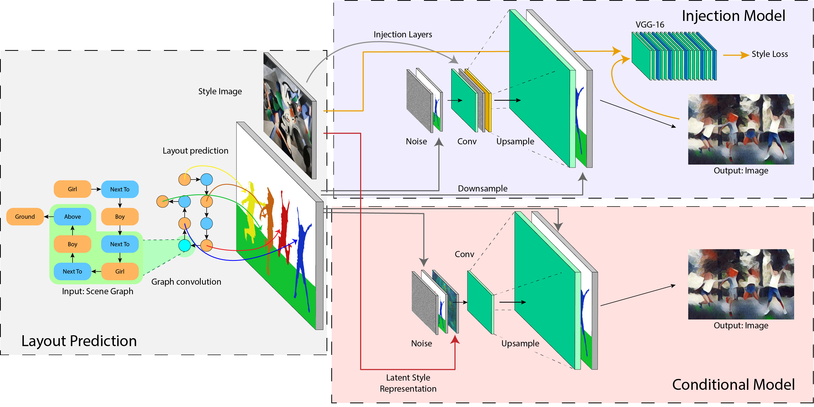

# Injection / Conditional SG2Im
Code for CS231n final project.

## Model
The model adopts the GCN from the original SG2Im formulation and experiments with the use of CoIN and AdaIN layers in the generator and discriminator.

  

